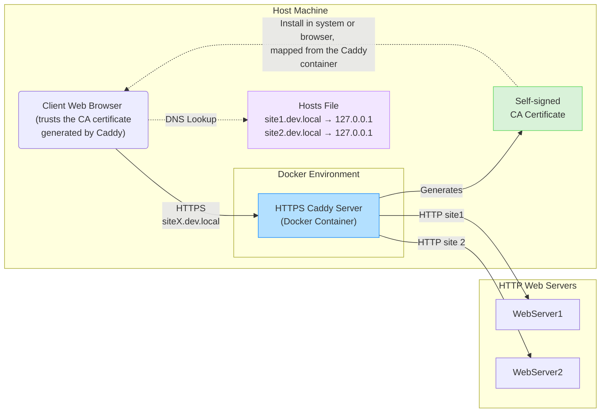

# How to add HTTPS to your local dev environments easily?

This is a Caddy server Docker container with a self-signed CA certificate. It is designed to be used for development purposes ONLY, allowing you to create and manage self-signed certificates easily.

The idea is simple: a reverse proxy that serves your sites over HTTPS using a self-signed certificate. This way, you can test your sites in a secure environment without the need for a public domain or an externally issued SSL certificate.



# Prerequisites
- Docker and Docker Compose installed on your machine
- A web server available on your host machine that you want to serve over HTTPS (e.g., Apache, Nginx, etc.)
- A domain name or a local hostname that you can use to access your sites (e.g., `site.dev.local` in your hosts file)

# Preparation Steps
## 1. Edit the `Caddyfile`
Copy `Caddyfile.example` to `Caddyfile` and edit it to suit your needs. The `Caddyfile` is where you define your sites and services.

Define your sites and services: make sure that your websites are available on the host machine at the specified ports. For example:
```caddyfile
site.dev.local {
    tls internal
    reverse_proxy host.docker.internal:81
}
```

I configured my other web-server to serve HTTP on port 81 of my machine, but that web-server does not support HTTPS.
In this example, `site.dev.local` will be served over HTTPS using a self-signed certificate, and it will reverse proxy requests to `host.docker.internal:81`.

## 2. Generate the CA certificate

Start the container, so it will generate the CA certificate if it doesn't exist:
```shell
docker-compose up
```
After this, you should see the CA certificate generated in the `caddy_data/caddy/pki/authorities/local/root.crt` file.

**Warning!** This CA certificate is self-signed and should only be used for development purposes. Do not use it in production environments.

## 3. Install the CA certificate to your system to avoid browser warnings

**Danger zone!** All the programs that trust this CA certificate will trust all the certificates signed by it. This means that any site served by Caddy using this CA certificate will be trusted by the software using your system's keychain.

After the CA certificate is generated, you need to install it on your system to avoid browser warnings when accessing sites served by Caddy.

Run the following command to add the CA certificate to the system keychain:
- MacOS:
```shell
sudo security add-trusted-cert -d -r trustRoot -k /Library/Keychains/System.keychain ./caddy_data/caddy/pki/authorities/local/root.crt
```

- Windows (not tested):
```powershell
certutil -addstore "Root" .\caddy_data\caddy\pki\authorities\local\root.crt
```

- Ubuntu Linux (not tested):
```shell
sudo cp ./caddy_data/caddy/pki/authorities/local/root.crt /usr/local/share/ca-certificates/
sudo update-ca-certificates
```

## 3.1 Alternatively, add the CA certificate to your browser

You can also add the CA certificate to your browser's trusted certificates. This is useful if you don't want to install it system-wide or if you're using a different operating system.


